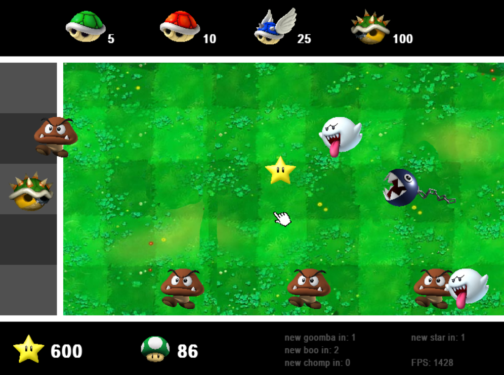
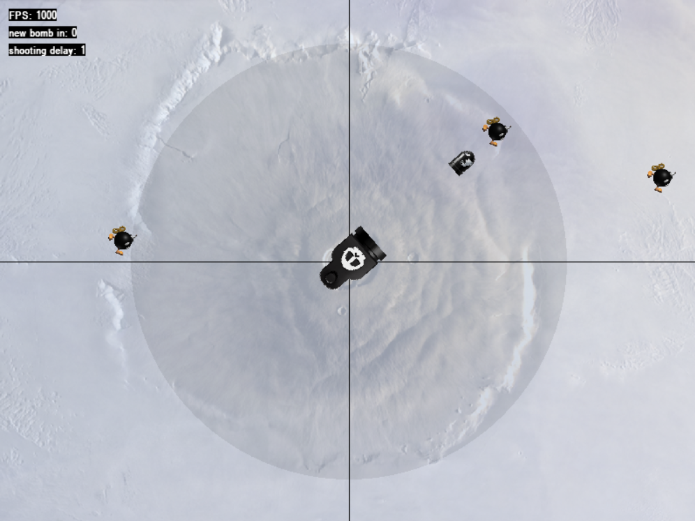
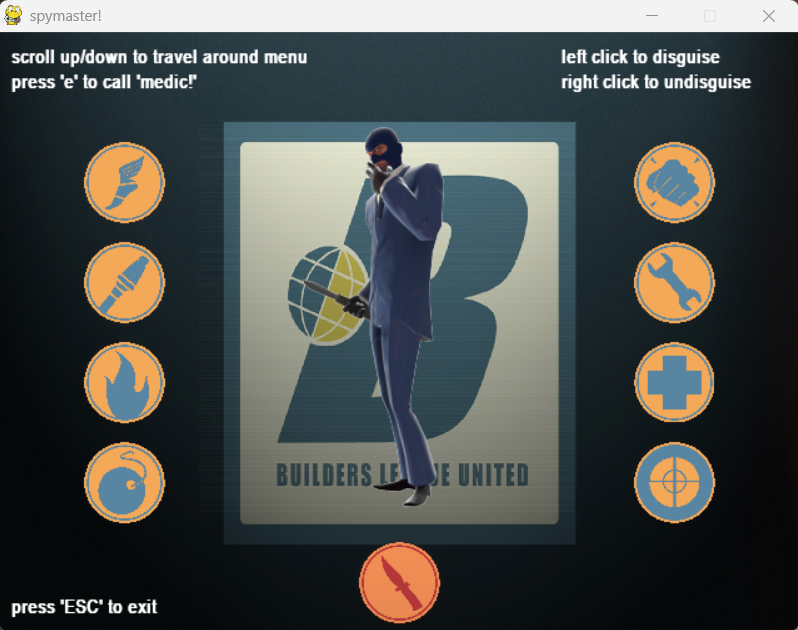
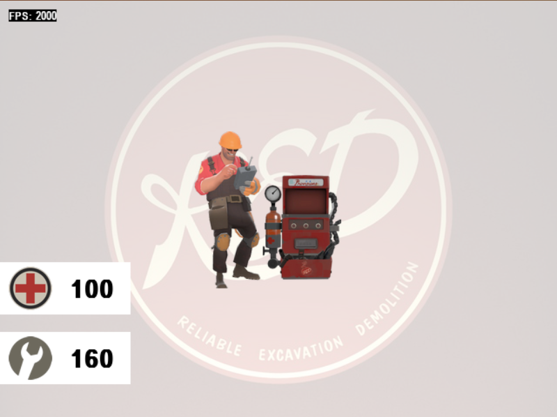
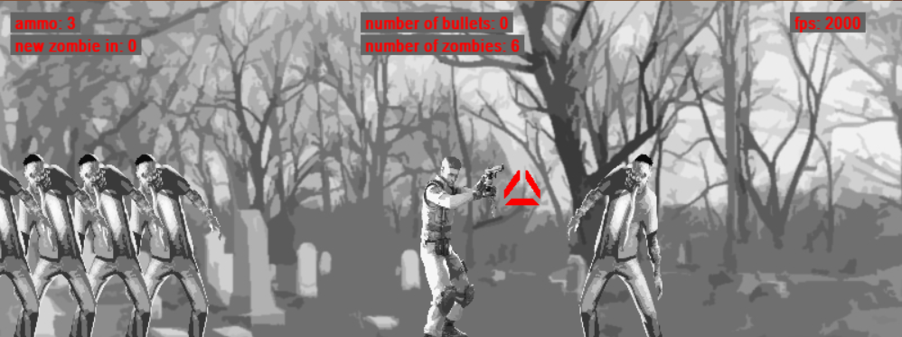
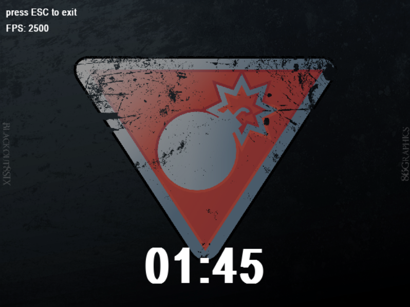
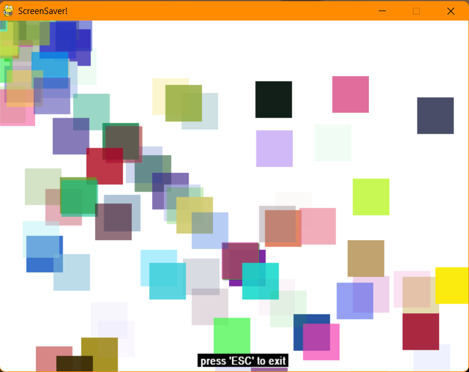
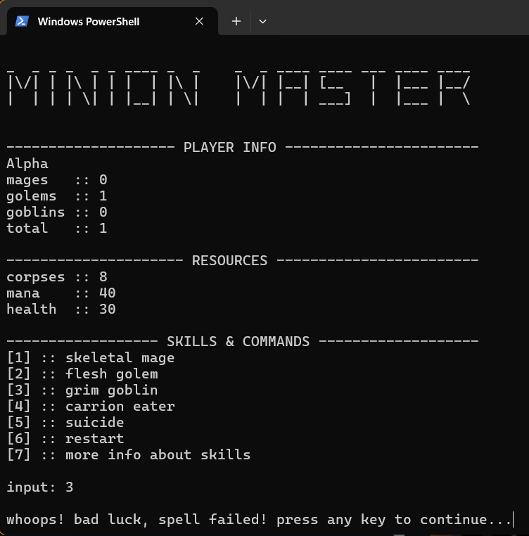
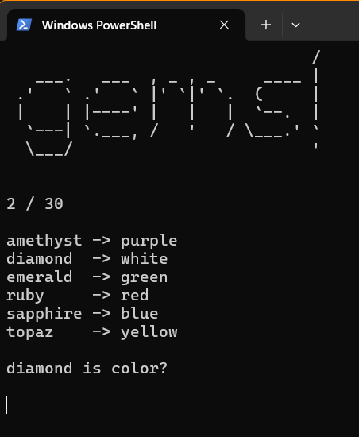

# Game Scripting - Python, Pygame

The following is a collection of 2D games created during my time as an instructor at the Houston Community College.

## Requirements

These games were created using Python 2.x and a compatible version of Pygame like version 2.0.3.

## Disclaimer

All images and sound assets used in this project are the property of their respective copyright holders. They are included here solely for educational and non-commercial purposes.

## Games

### ShellShock

### Sentry

### Spymaster

### Engie

### Outbreak

### PyBomb

### Screensaver

### Minion Master

### Gems

